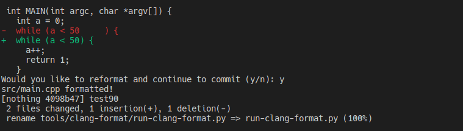

# Local Git Checks
This repo provides a simple example for how to run clang format in your local repositories by using git hooks. This allows developers to run clang format locally before pushing changes to the remote repo.
# Clang-Format

## Installing 

Install clang-format package:

`sudo apt-get install clang-format`

## Integrating with git

Set a configuration entry in git to use clang-format previously installed:

`git config --local clangFormat.binary clang-format`

Add the formatting convention file to git configuration:

`git config --local clangFormat.style file`

**Note**: This command tells git to search in the local repository for a `.clang-format` file.

## Setup your local repo 

Copy clang format run script to your local repository:

`cp run-clang-format.py path/to/target/repo/`

Copy clang format file to your local repository:

`cp .clang-format path/to/target/repo/`

## Add pre-commit hook script

Add the pre-commit hook `check_format` to your local target repository to check the formatting for each commit:

`cp hooks/check_format path/to/target/repo/.git/hooks/pre_commit`

Make the file executable in your local repository hooks:

`chmod +x path/to/target/repo/.git/hooks/pre_commit`

## How to use

Just commit your changes and a prompt will ask you if you want to format before committing your changes.

Here is an example:

To use the script manually on a file or dir just run :

`./run-clang-format.py --clang-format-executable clang-format --style file -r path/to/file`

or 

`./run-clang-format.py --clang-format-executable clang-format --style file -r path/to/dir`

## Used tool versions

- clang-format version 10.0.0-4ubuntu1
- git version 2.25.1
